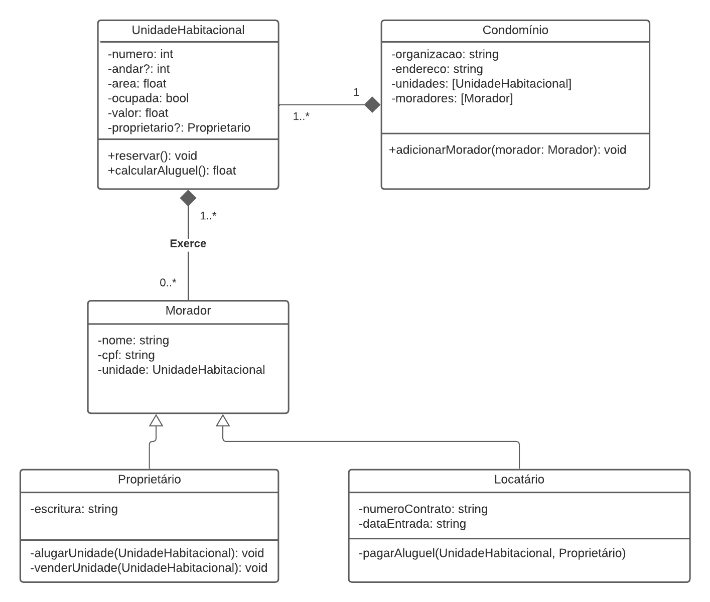

# Pré-entrevista
#### 1. O que é “pensar grande” para você? Dê exemplos de vezes em que você aplicou isso.
R. Para mim, pensar grande é estabelecer metas ou sonhos que tragam grande realização ou bem-estar. Por exemplo, no desenvolvimento de um jogo, podemos pensar pequeno
e desenvolver um jogo 2D simples, sem muita história, ou pensar grande e criar um bem desenhado em 3D com uma história empolgante. Além disso, "pensar grande"
também pode incluir a venda desse jogo ou a apresentação dele em um evento de games, sempre visando o crescimento da ideia.

#### 2. Quem é você/o que faz quando ninguém está vendo?
R. Antes de tudo, sou um ser humano, ou seja, naturalmente curioso e intrigado pelo aprendizado! Quando ninguém está olhando, sempre estou procurando ou estudando algo
que quero. Tenho o aprendizado como hobby, tanto para fins profissionais quanto simplesmente pelo prazer de saber como as coisas funcionam. Fico facilmente fascinado
por assuntos complexos, pois gosto da sensação de se esforçar e persistir, e compreender depois de todo esse trabalho árduo. Devido a essas características, sou
entusiasta de assuntos relacionados às ciências exatas!

#### 3. Qual a maior motivação para escolher a área de tecnologia enquanto carreira?
R. Desde pequeno, sempre tive muito contato com computadores, jogos e eletrônicos. Eu era aquela criança curiosa que sempre acabava baixando algum tipo de vírus no
computador e precisava arrumar para não ser pego pelos meus pais. Com o tempo, por ter esse perfil curioso, fui criando interesse em como essas coisas funcionavam e
comecei a querer trabalhar nessa área. Inicialmente, meu foco era ser programador e criar jogos e softwares interessantes a partir da minha imaginação. Acabei
me interessando pelo campo da cibersegurança, mas minha parte criativa e outros interesses acabaram me puxando de volta.

#### 4. Qual a maior motivação para querer estagiar com desenvolvimento Android?
R. Além de adorar programar, descobri que o ambiente mobile é a forma mais prática e versátil de alcançar pessoas de todos os tipos e ajudá-las ou entretê-las com
soluções inovadoras. Para mim, o emprego ideal é aquele que me permite usar minhas habilidades como ferramentas que possam ajudar os outros ou a sociedade de
alguma forma. Foi por isso que escolhi me dedicar ao desenvolvimento de aplicativos Android, pois acredito que essa plataforma é perfeita para transformar essas ideias
em realidade.

## Challenge Técnico 1

Aqui está o link direto para o arquivo do código principal do challenge: <a href="challenge_1/src/main/kotlin/Main.kt" >Main.kt</a>

Para executar, faça o download da pasta e rode o código no IntelliJ ou outra IDE de preferência.

## Challenge Técnico 2
Diagrama de classe contendo a representação de um contexto de condomínios:
 

